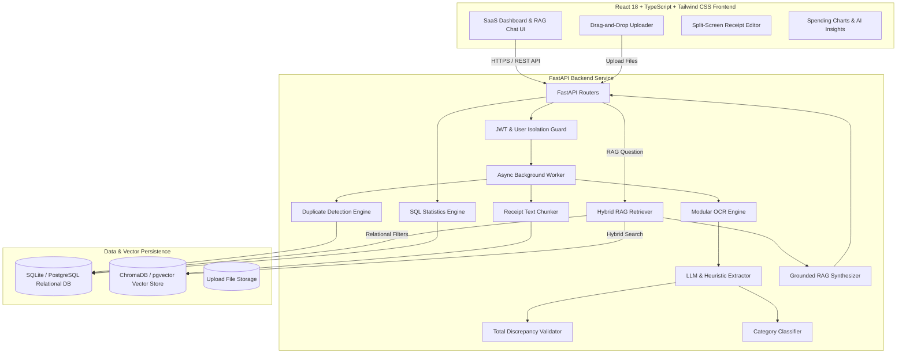

# ReceiptRAG 🧾⚡

ReceiptRAG is an enterprise-grade AI-powered receipt and document intelligence application. It enables users to upload purchase receipts, invoices, and bills (JPG, PNG, PDF), run modular OCR with image preprocessing, extract structured JSON metadata, index text chunks into a vector database with strict multi-tenant user isolation, ask natural-language RAG questions with source citations, and explore dynamic spending analytics.

---

## Key Features

- **JWT Authentication & Strict Multi-Tenant Data Isolation**: Users only ever access, search, and query their own receipts and vector embeddings.
- **Multi-Format Receipt Upload**: Supports drag-and-drop uploading for JPG, PNG, and PDF files up to 15MB with background processing.
- **Asynchronous Processing Pipeline**: Visible status states (`PENDING` → `PROCESSING` → `COMPLETED` / `FAILED`).
- **Modular OCR Engine**: Image preprocessing (Grayscale, Contrast enhancement, Denoising, Deskew) using PyTesseract with intelligent fallback for zero-config offline execution.
- **LLM Structured Extraction**: Extracts `merchant_name`, `date`, `receipt_number`, `currency`, `subtotal`, `tax`, `discount`, `total`, `payment_method`, and itemized line items.
- **Total Consistency Validation**: Automatically checks if `subtotal + tax - discount ≈ total` and flags discrepancies for user verification.
- **Duplicate Receipt Detection**: Combines SHA-256 exact file hash checking with metadata similarity scoring (Merchant + Date + Total).
- **Embedded ChromaDB Vector DB**: Default zero-config local vector database with extensible support for PostgreSQL + `pgvector`.
- **Hybrid RAG Retrieval**: Combines semantic vector similarity search with relational SQL metadata filtering (`user_id`, merchant, category, date range, amount range).
- **Grounded AI Chat RAG**: ChatGPT-style interface with answer synthesis grounded strictly in retrieved receipt context and interactive click-to-view source citation cards.
- **Interactive Spending Analytics**: Live stats, monthly spending trends, category breakdown pie charts, top merchant analysis, and data-driven AI insights.
- **Split-Screen Receipt Editor**: Left panel document preview (Image/PDF viewer), right panel editable metadata, line items table, and raw OCR text inspector.

---

## Architecture Diagram



---

## Folder Structure

```
receipt-rag/
├── backend/
│   ├── app/
│   │   ├── api/          # FastAPI router endpoints (auth, receipts, chat, search, analytics)
│   │   ├── db/           # SQLAlchemy database session & engine
│   │   ├── models/       # Relational models (User, Receipt, ReceiptItem, OCRResult, ChatSession, ChatMessage)
│   │   ├── schemas/      # Pydantic schema contracts with ConfigDict
│   │   ├── services/     # OCR, Extraction, Categorization, Duplicate, Embedding, Analytics services
│   │   ├── rag/          # Receipt Chunker, Hybrid Retriever, Prompts, ChromaDB Vector Store
│   │   ├── utils/        # Security (JWT & PBKDF2/Bcrypt password hashing), File & PDF converters
│   │   ├── config.py     # BaseSettings configuration
│   │   └── main.py       # FastAPI application entrypoint
│   ├── tests/            # Pytest test suite (Auth, Receipts, RAG, User Isolation)
│   ├── requirements.txt  # Backend dependencies
│   └── Dockerfile
├── frontend/
│   ├── src/
│   │   ├── components/   # Layout (Sidebar, Navbar), Receipts (Card, Uploader), Chat (Window, SourceCard), Analytics (Charts)
│   │   ├── pages/        # Login, Register, Dashboard, Receipts, ReceiptDetails, Chat, Analytics, Settings
│   │   ├── services/     # Axios client with Bearer Token interceptors
│   │   ├── context/      # AuthContext for JWT user session management
│   │   ├── types/        # TypeScript interfaces
│   │   ├── App.tsx       # Main Router & Protected Layout wrapper
│   │   └── main.tsx      # React root entrypoint
│   ├── package.json
│   ├── vite.config.ts
│   └── tailwind.config.js
├── docker-compose.yml    # Docker Compose for PostgreSQL + pgvector, Backend, Frontend
├── .env.example          # Environment variables template
└── README.md
```

---

## Local Installation & Setup Instructions

### Prerequisites
- Python 3.10+
- Node.js 18+ and npm 9+
- (Optional) Tesseract OCR engine installed on system PATH for native OCR.

### 1. Backend Setup

```bash
cd backend

# Create virtual environment
python -m venv .venv

# Activate virtual environment
# On Windows:
.\.venv\Scripts\activate
# On Linux/macOS:
# source .venv/bin/activate

# Install backend dependencies
pip install -r requirements.txt

# Run the FastAPI server
uvicorn app.main:app --reload --host 127.0.0.1 --port 8000
```
Backend API will be accessible at: `http://127.0.0.1:8000` (Swagger docs at `http://127.0.0.1:8000/docs`).

### 2. Frontend Setup

```bash
cd frontend

# Install Node dependencies
npm install

# Start Vite development server
npm run dev
```
Frontend Web Application will be accessible at: `http://localhost:3000`.

---

## Environment Variables (`.env`)

Copy `.env.example` to `.env` inside `backend/`:

```env
ENVIRONMENT=development
SECRET_KEY=receiptrag_super_secret_jwt_key_2026_change_in_prod
ACCESS_TOKEN_EXPIRE_MINUTES=10080

DATABASE_URL=sqlite:///./receiptrag.db

UPLOAD_DIR=./uploads
VECTOR_DB_DIR=./chroma_db

# Optional: Set OpenAI API key for online LLM & Embedding models.
# If omitted, local deterministic extraction & embedding models are used automatically!
OPENAI_API_KEY=
EMBEDDING_MODEL=text-embedding-3-small
LLM_MODEL=gpt-4o-mini
```

---

## Running Automated Tests

To execute the automated backend unit and integration test suite (covering Auth flow, Receipt Upload, RAG retrieval, Analytics, and strict User Isolation):

```bash
cd backend
.\.venv\Scripts\python.exe -m pytest -v
```

### Verified Test Results
```text
tests/test_all.py::test_auth_flow PASSED                                 [ 25%]
tests/test_all.py::test_receipt_upload_and_pipeline PASSED               [ 50%]
tests/test_all.py::test_user_isolation PASSED                            [ 75%]
tests/test_all.py::test_analytics_empty PASSED                           [100%]

======================= 4 passed in 5.99s =======================
```

---

## Running with Docker Compose

To launch the full stack with PostgreSQL and `pgvector`:

```bash
docker compose up -d --build
```
- Frontend: `http://localhost:3000`
- Backend API: `http://localhost:8000`
- PostgreSQL + pgvector: `localhost:5432`

---

## License & Usage

ReceiptRAG is built as a production-grade portfolio application for AI document intelligence, OCR extraction, and grounded RAG applications.
